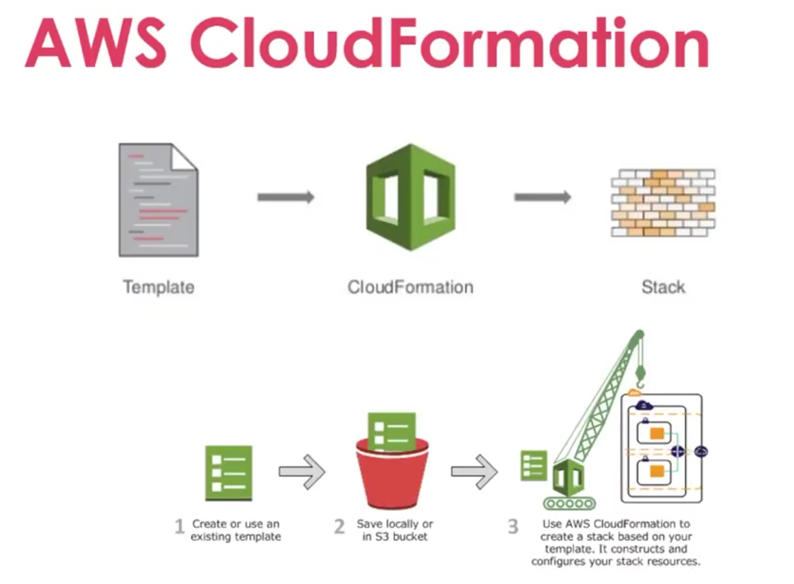
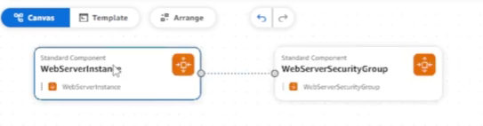
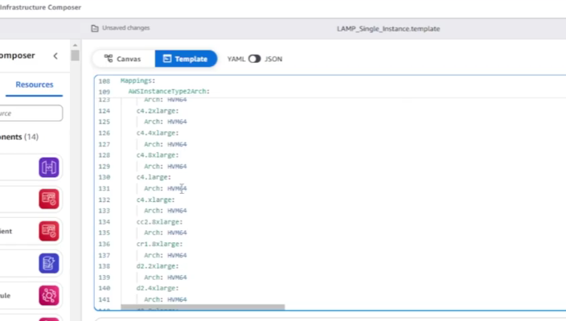

# Desafio AWS CloudFormation Templates - DIO \& GFT

## Sobre o Projeto

Este projeto foi desenvolvido durante o bootcamp GFT - Fundamentos de Cloud com AWS, realizado pela DIO.

O objetivo deste laboratório foi compreender os conceitos de Infrastructure as Code (IaC) utilizando AWS CloudFormation, explorando a criação automatizada de recursos na AWS através de templates em YAML e JSON.

---

## Conceitos Estudados

Durante as aulas foram abordados os seguintes conceitos:

- AWS CloudFormation
- Infrastructure as Code (IaC)
- Templates em YAML e JSON
- Criação de Stacks
- Automação de infraestrutura
- Padronização de ambientes
- Provisionamento automatizado de recursos AWS
- Infrastructure Composer
- Diferenças entre AWS CloudFormation e Terraform

---

## Capturas de Tela

### Visão Geral do AWS CloudFormation

---

### Compositor de Infraestrutura

---

### Editor de Templates YAML/JSON

---

## Conclusão

Este desafio ajudou a compreender os conceitos básicos de automação de infraestrutura utilizando AWS CloudFormation.

Além disso, foi possível visualizar como templates podem ser utilizados para automatizar a criação de recursos na AWS utilizando Infrastructure as Code (IaC).

---

## Créditos

Projeto desenvolvido durante o bootcamp [GFT](https://www.gft.com/br/pt) - Fundamentos de Cloud com AWS, realizado pela \[DIO](https://dio.me).

Conteúdo e desafio apresentados por [Alexsandro Lechner](https://linkedin.com/in/alexsandrolechner)  

GitHub: [@alexsandrolechner](https://github.com/alexsandrolechner)
